# Tiksu Golf

Tiksu Golf is a golfing game where you play as Tiksu and try to continuously hole the ball across the generated golf course. It is written in Rust using the Bevy game engine. [[GitHub-Repository](https://github.com/timoschwarzbach/tiksu-golf)]

Our initial release can be downloaded from the repository’s releases page [[Link](https://github.com/timoschwarzbach/tiksu-golf/releases/tag/initial-progress)].

Our final release is found in this release [[Link](https://github.com/timoschwarzbach/tiksu-golf/releases/tag/final-release)].

## Gameplay Video

https://youtu.be/p3_TyHxR-SA

# Task division

Henry: Water Shader, Trajectory visuals, Lighting

Timo: Physics, Flags, Tiksu, Game loop

Louis: Terrain generation, Course generation, Chunk management

Tiksu: Mental support and armed robbery

# Game Loop

When you launch the game, you will see a brief flyover over the course before you enter the role of Tiksu.

The goal of the game is to get the golf ball from start to finish with as little punches as possible. You can control the direction and angle at which Tiksu desires to hit the ball. After confirming the parameters, you get presented with a skill challenge where you need to press the spacebar twice: once to set your power and another time to set your accuracy. The accuracy needs to be as close to the origin as possible (in the red area), otherwise, the shot is considered missed and the ball moves in a random direction.

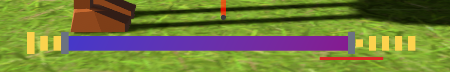

When you eventually hit the golf ball in the flagpole a short win animation with Tiksu is displayed (inspired by Mario Golf N64) after which you will see a top down view and a regeneration of the course is triggered and the game loop repeats – There is no end; Implementing this kind of sequence using ECS is a little bit tricky as it is not designed for sequences. We solved this trough different game states and systems that control timers to check if the game should switch into another state.

# Procedural Generation

Our map and golf course are generated procedurally. It includes a grass ground with variations in height, ponds when the height is under a certain threshold, forests and a golf course that may include sand banks.

Everything is made up of 32mx32m chunks, and every golf course is based on a random seed. These chunks are loaded and unloaded based on their distance to chunk loaders. Chunk loaders are components that can be given to entities that keep chunks within a configurable distance loaded. Currently, only the golf ball and the camera have one. We also included a special animation for freshly loaded and unloaded chunks.

## Terrain

The terrain height is produced by adding multiple layers of Perlin noise. This terrain is coloured based on the kind of material that is generated at its coordinates. To ensure that each course is beatable, the start and end of courses are ensured to never be under water level.

## Water

Everything below Y=-5 is filled with water. Each chunk that has parts of its terrain below water level is given a water plane. Chunks that are fully above water level are generated without one.

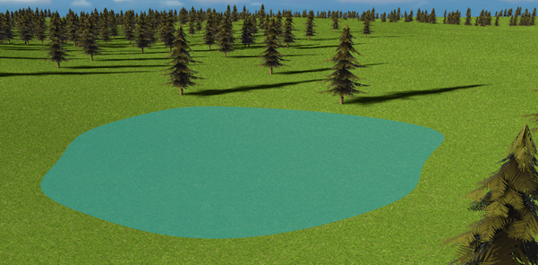

### Shader

For the water mesh we sample a normal map texture [Link] twice to use it for the lighting in the fragment shader. We pass the texture, sampler and the time as parameters to the shader. This shader is mostly concerned with manipulating the UV coordinates in form of scaling and translating them for the sampling. We use sine and cosine functions for that. In the end we add the precomputed normals from bevy and add our normals from the normal map to pass them to bevy’s lighting functions. Hence, our reflections on the water are slightly shifted, but without explicitly mentioning it, you wouldn’t really notice it.

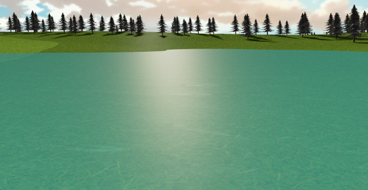

## Forest

Forests can be seen generated throughout the world map. Their location and density are determined by Perlin noise. Though, trees cannot generate on the golf course, sand or water.

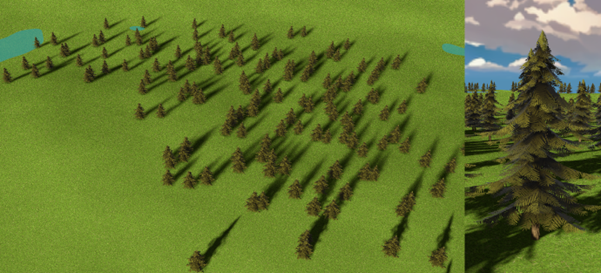

## Course

Each golf course hat a start, an end, and a way to get there. They have the shape of a randomly generated polynomial. We use a custom distance-estimation algorithm to determine the approximate distance from any point to the course to determine if that point is on the course or not.

We wrote a shader extension for the bevy standard material that lets us change the colour of the ground depending on where each fragment is on the world map.

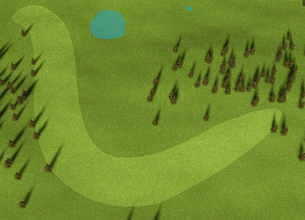

## Flagpole

We place a cute little flagpole at the end of each course. Its approximate distance and direction are also shown in the UI (see the UI section).

The pole is a simple cylinder while the cloth is a custom mesh with a custom material to simulate its movement in the wind. Figuring out the maths for this was challenging. Also managing to apply bevy’s PBR lighting in the fragment shader was difficult as well as getting bevy to cast shadows that react to the movement of the flag (we had to use the pre-pass vertex shader).

## Bunkers

Sand bunkers are randomly spread across the course with the exception of the start and the end. Within sand bunkers, the ground is sand-coloured, indented and trying to kick the golf ball from here will greatly reduce its speed.

## Conclusion

In combination, interesting structures could be generated °~°

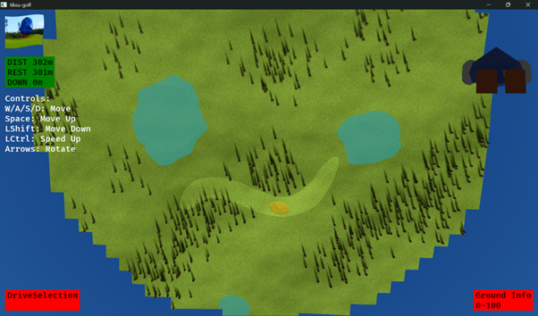

# Physics

The behaviour of our golf ball when it is punched by Tiksu is managed by a third-party physics library called avian3d. This means we didn’t have to think too much about physics, resistance and collisions and allowed us to focus on other computer graphics topics.

Once we had a functioning course generation, we used the information about the ground material to influence the resistance when hitting the ball. We didn’t have time to also apply this different force when the ball is rolling on the ground.

However, achieving realistic golf ball behaviour was difficult, nonetheless. We had to play a lot with our parameters: changed the mass, inertia, collision shape and friction – and we we’re only able to achieve a satisfying result shortly before the end of the project. Another issue was our ball occasionally falling through the colliders of our world. We we’re able to fix this by adding thickness to the collider of our ground mesh.

## Tiksu

Our game is Tiksu themed, therefore we must of course include a model of Tiksu. He has a low poly mesh, multiple materials with different properties, a skeleton and some built in animations. The animations are an idle animation, a punch animation and a completely broken chopper animation.

Modelling was quite difficult, and I am certainly not very happy with the quality of the result – especially animations. This was due to time constrains, us never having done Blender before, and us also doing the model before Blender was introduced in Basic II. However, I think that the result kind of fits the theme and quirkiness of our game.

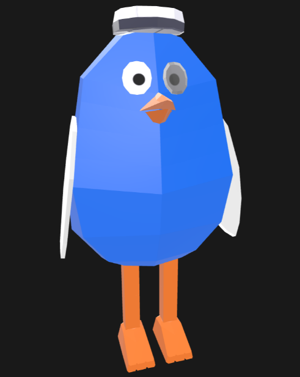

# Skybox

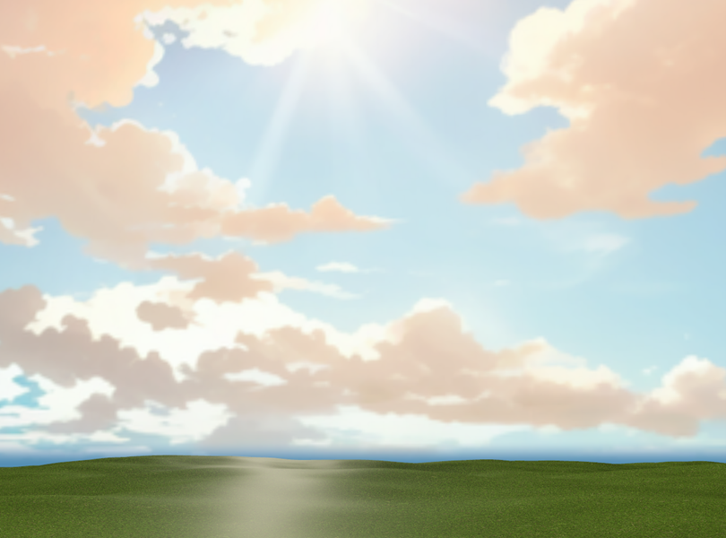

The idea of a skybox is pretty straightforward. We wanted to implement it in order to give our world more characteristics. Bevy requires the skybox as an array of 6 PNGs in a particular order (or some other cube map format we're not familiar with). We solved this by explicitly telling bevy that our png should be read as an image array during asset loading. It was not difficult to add the skybox, but we had problems finding a good and free to use skybox as well as aligning the sun in the skybox and bevy’s light source took time and trial and error.

# User Interface

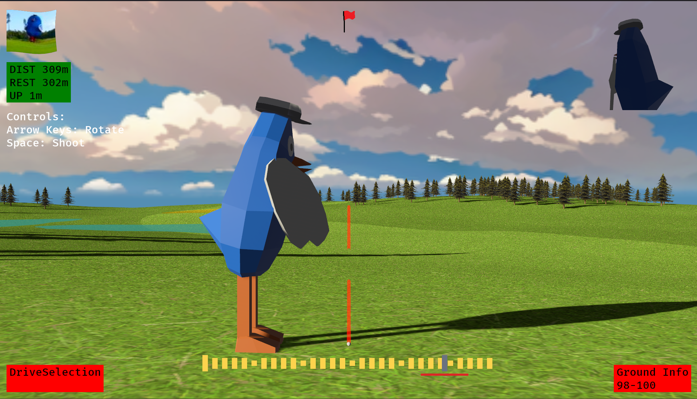

## 2D-Flag

In the top left corner, there is a 2d flag of Tiksu on a grass field. It is moving in the wind. It is simple but was quite challenging as this was the first shader we’ve written. We had problems with writing the image data into the UI and especially clearing the previous render before writing into the UI. We planned to display the number of the hole you’re currently at – never got to it.

## Track information

Under the flag, a bit of information is displayed about the current course. It displays the course length, its remaining distance and height difference to the hole. It was a challenge to write a system that updates the UI due to our unfamiliarity with bevy.

## Control Guide

Under the track information on the left-hand side, you can see a display of the possible controls in the aim state (the only state you have control over in the game). Implementing this had no real challenges. This was the first piece of the UI we’ve written for Tiksu Golf.

## Selected club

In the bottom left corner, a UI stating the currently selected golf club can be seen. This is non-functional: We wanted to have the ability to switch between different clubs (driver, iron, wedges, putter) but we also never got to this point. So instead, we replaced this feature by the ability to be able to configure the vertical angle at which you hit the ball.

## Flagpole direction indicator

When you look in the direction of the flag, you will see a little red flag in the UI. We drew this in paint and display it based on the angle between where you are looking and in what direction the flag is. Duh. Pretty straight forwards, css positioning was slightly difficult to get right.

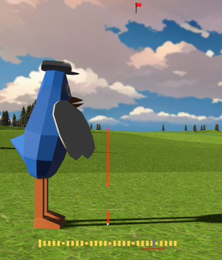

## Trajectory visuals

The trajectory of the golf ball can be controlled with the arrow up and down keys. It is constructed of a thin cylinder that gets spawned at the location of the golf ball and either gets tilted up or down to show the angle of the punch. We created the line effect in the fragment shader by returning a transparent colour for the fragments on certain z-coordinates that change over the time.

## Camera direction indicator (Tiksu)

Initially, we wanted to include a wind indication model – like in the original. However, we never had time to implement is, as the priority was not high. So, instead, we now show the direction in which the currently active camera is looking. To achieve this, we spawn a Tiksu and a camera in another world layer (this can be thought of as a different scene). The image that this camera sees, is layered on top of our main scene as part of the UI. Challenges included finding out how to implement this using different world layers. Also, once we added animations to the Tiksu in the main world, the other Tiksu would spawn at our world origin. We believe this was because they we’re sharing the same mesh handler – however, we had great difficulties fixing this (cloning didn’t help). So they are now two completely separate models.

## Ground information

The bottom right shows an indication as to how much resistance the ground has at the current golf ball’s position.

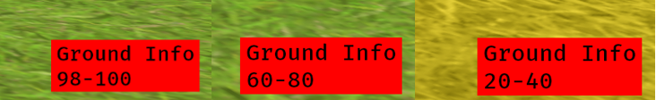
